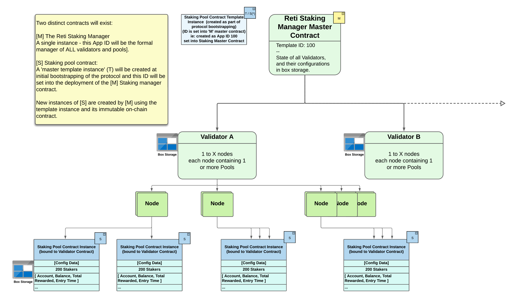
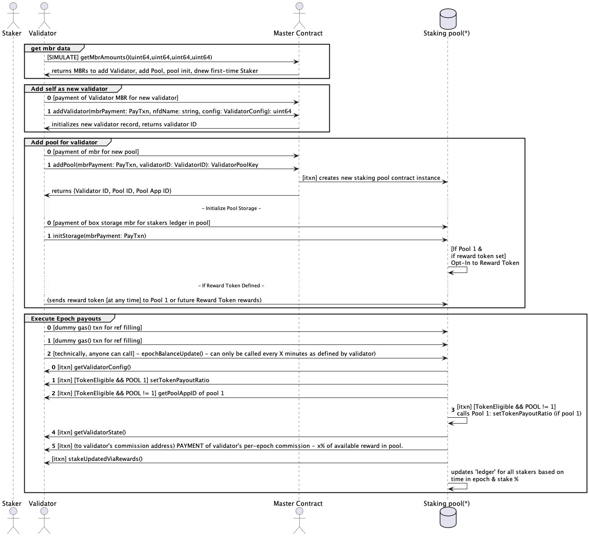
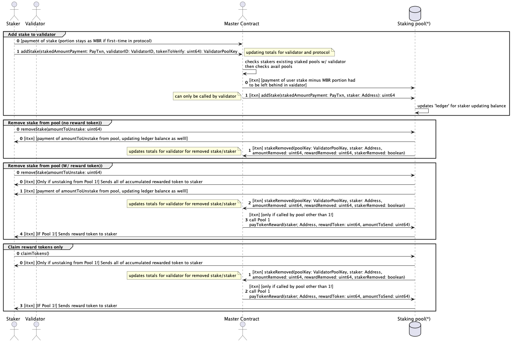

# Smart Contracts

The contracts are written using AlgoKit and TEALScript.  See [Tealscript](https://tealscript.algo.xyz) for details.

See the README in the contracts/ directory for build / testing details.

<figure><figcaption>
General Overview
</figcaption></figure>

<figure><figcaption>
Basic Operations
</figcaption></figure>

***

## **Validator Operations**

<figure><figcaption></figcaption></figure>

## **Staking Operations**

<figure><figcaption></figcaption></figure>
